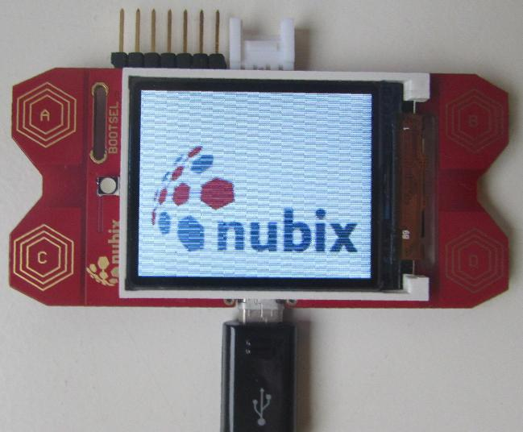

OPNIC

[See project on GitHub](https://github.com/nubix-de/opnic/)

# Quick-start

1. fit a 2¢ euro coin into BOOTSEL
2. connect the board via USB to the computer
3. remove the coin
4. run: `./build.sh -+ snake release uf2`

For more information, read the [development](DEVELOPMENT.md) file.

# Folder structure

Folder structure is the following:

- `doc`: contains the documentation
- `hardware`: contains the EAGLE files
- `firmware`: contains the firmware-related folders, like `micropython` and
  `cpp`

Each folder inside the `micropython` and `cpp` directories contains the so
called "projects". A project can be a library with a test script or a target
application.

Note on project compilation: if you don't have the pico-sdk installed on your
system, it will download from the Internet before compiling.

# How to run the build script

All `build.sh` files need to know which project to compile / run. For example
`./build.sh touch [options]` will tell it to use the `touch` project. For more
information, please use the `-h` option.

**Please note that for OPNIC Board Rev. A, programming with Micropython is
unavailable.**

# Thank you

Thank you Ted Rossin for allowing us to make usage and small changes to your
[TFT Display GUI on Raspberry Pi
Pico](https://sites.google.com/site/tedrossin/home/electronics/raspberry-pi-pico#h.tnj1ljp6rrfh)
project.
